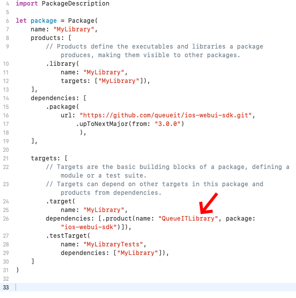

[](https://cocoapods.org/pods/QueueITLibrary)

# Queue-It iOS WebUI SDK

Library for integrating Queue-It's virtual waiting room into an iOS app that is written in either objective-c or swift.

## Installation

Before starting please download the whitepaper **Mobile App Integration** from GO Queue-it Platform.
This whitepaper contains the needed information to perform a successful integration.

### Requirements

In version 2.12.X the QueueITEngine will switch on the installed version of iOS as the old UIWebView has been marked deprecated from iOS 12. If the iOS version is above version 10.0.0 the newer WKWebView will be used instead of UIWebView.

Therefore the minimum iOS version for 2.12.X is 8.3, where WKWebViews were introduced. In the same round we have removed the target limit for iPhone only, so the library can be used with iPads as well.

From version 2.13.0 the QueueITEngine no longer supports the UIWebView and will only use WKWebView. Furthermore, the lowest supported version of iOS has been updated to version 9.3.

Version 3.0.0 introduces breaking chances as the interface to `QueueITEngine` has been modified so the `run` function is using the NSError pattern to return errors instead of throwing a NSException.

### XCFramework

You can manually add the XCFramework that's published in [releases](https://github.com/queueit/ios-webui-sdk/releases).

### CocoaPods

[CocoaPods](http://cocoapods.org) is a dependency manager for Cocoa projects. You can install it with the following command:

```bash
gem install cocoapods
```

To integrate the SDK into your Xcode project using CocoaPods, specify it in your `Podfile`:

```ruby
source 'https://github.com/CocoaPods/Specs.git'
platform :ios, '9.3'
use_frameworks!

target '<Your Target Name>' do
    pod 'QueueITLibrary', '~> 3.5.0'
end
```

Then, run the following command:

```bash
pod install
```

## Swift Package Manager

1. In Xcode, select File > Add Packages
2. For the URL, paste in `https://github.com/queueit/ios-webui-sdk.git`
3. Configure how you'd like to track changes, and add to your project
4. Finally, click Add Package

### Possible error generated when adding Package Dependency
* Error generated during build "product 'QueueIt' required by package 'mylibrary' target 'MyLibrary' not found"
* resolved by updating the dependency product name to "QueueItLibrary" for package "ios-web-sdk" 

#### Example: 


## Usage

We have a repository with a demo app [here](https://github.com/queueit/ios-demo-app "iOS demo app"), but you can get the basic idea of how to use the library in the following example.

In this example we have a `UITableViewController` that we want to protect using Queue-it. The header file of `UIViewController` has following signature:

```objc
#import <UIKit/UIKit.h>
#import "QueueITEngine.h"

@interface TopsTableViewController : UITableViewController<QueuePassedDelegate, QueueViewWillOpenDelegate, QueueDisabledDelegate, QueueITUnavailableDelegate, QueueViewClosedDelegate, QueueSessionRestartDelegate>
-(void)initAndRunQueueIt;
@end
```

The QueueITEngine class will open a web view to display the queue found from parameters provided.

The implementation of the example controller looks like follows:

```objc
-(void)initAndRunQueueIt
{
    NSString* customerId = @"yourCustomerId"; // Required
    NSString* waitingRoomIdOrAlias = @"yourWaitingRoomIdOrAlias"; // Required
    NSString* layoutName = @"yourLayoutName"; // Optional (pass nil if no layout specified)
    NSString* language = @"en-US"; // Optional (pass nil if no language specified)
    NSString* waitingRoomDomain = @"<custom waiting room domain>.com" // Optional (pass nil if no waitingRoomDomain specified, required for Behind Proxy)
    NSString* queuePathPrefix = @"queue" //// Optional (pass nil if no queuePathPrefix specified, required for Behind Proxy)

    self.engine = [[QueueITEngine alloc]initWithHost:self customerId:customerId eventOrAliasId:waitingRoomIdOrAlias layoutName:layoutName language:language waitingRoomDomain:waitingRoomDomain queuePathPrefix:queuePathPrefix];
    [self.engine setViewDelay:5]; // Optional delay parameter you can specify (in case you want to inject some animation before Queue-It UIWebView or WKWebView will appear
    self.engine.queuePassedDelegate = self; // Invoked once the user is passed the queue
    self.engine.queueViewWillOpenDelegate = self; // Invoked to notify that Queue-It UIWebView or WKWebview will open
    self.engine.queueDisabledDelegate = self; // Invoked to notify that queue is disabled
    self.engine.queueITUnavailableDelegate = self; // Invoked in case QueueIT is unavailable (500 errors)
    self.engine.queueUserExitedDelegate = self; // Invoked when user chooses to leave the queue
    self.engine.queueViewClosedDelegate = self; // Invoked after the WebView is closed
    self.engine.queueSessionRestartDelegate = self; // Invoked after user clicks on a link to restart the session. The link is 'queueit://restartSession'.
    
    NSError* error = nil;
    BOOL success = [self.engine run:&error];
    /**
    To enqueue with an enqueue-token or key use one of the following:

    [self.engine runWithEnqueueKey:@"keyValue" error:&error];
    [self.engine runWithEnqueueToken:@"tokenValue" error:&error];
    **/
    if (!success) {
        if ([error code] == NetworkUnavailable) {
            // Thrown when Queue-It detects no internet connectivity
            NSLog(@"%ld", (long)[error code]);
            NSLog(@"Network unavailable was caught in DetailsViewController");
            NSLog(@"isRequestInProgress - %@", self.engine.isRequestInProgress ? @"YES" : @"NO");
        }
        else if ([error code] == RequestAlreadyInProgress) {
            // Thrown when request to Queue-It has already been made and currently in progress. In general you can ignore this.
        }
        else {
             NSLog(@"Unknown error was returned by QueueITEngine in DetailsViewController");
        }
    }
}

// This callback will be called when the user has been through the queue.
// Here you should store session information, so user will only be sent to queue again if the session has timed out.
-(void) notifyYourTurn:(QueuePassedInfo*) queuePassedInfo {
    NSLog(@"You have been through the queue");
    NSLog(@"QUEUE TOKEN: %@", queuePassedInfo.queueitToken);
}

// This callback will be called just before the webview (hosting the queue page) will be shown.
// Here you can change some relevant UI elements.
-(void) notifyQueueViewWillOpen {
    NSLog(@"Queue will open");
}

// This callback will be called when the queue used (event alias ID) is in the 'disabled' state.
// Most likely the application should still function, but the queue's 'disabled' state can be changed at any time,
// so session handling is important.
-(void)notifyQueueDisabled:(QueueDisabledInfo* _Nullable) queueDisabledInfo {
    NSLog(@"Queue is disabled");
}

// This callback will be called when the mobile application can't reach Queue-it's servers.
// Most likely because the mobile device has no internet connection.
// Here you decide if the application should function or not now that is has no queue-it protection.
-(void) notifyQueueITUnavailable:(NSString*) errorMessage {
    NSLog(@"QueueIT is currently unavailable");
}

// This callback will be called after a user clicks a close link in the layout and the WebView closes.
// The close link is "queueit://close". Whenever the user navigates to this link, the SDK intercepts the navigation
// and closes the webview.
-(void)notifyViewClosed {
    NSLog(@"The queue view was closed.")
}

// This callback will be called when the user clicks on a link to restart the session.
// The link is 'queueit://restartSession'. Whenever the user navigates to this link, the SDK intercepts the navigation,
// closes the WebView, clears the URL cache and calls this callback.
// In this callback you would normally call run/runWithToken/runWithKey in order to restart the queueing.
-(void) notifySessionRestart {
    NSLog(@"Session was restarted");
    [self initAndRunQueueIt];
}
```

As the App developer you must manage the state (whether user was previously queued up or not) inside the apps storage.
After you have received the "notifyYourTurn callback", the app must remember this, possibly with a date / time expiration.
When the user goes to the next page - you check this state, and only call QueueITEngine.run in the case where the user did not previously queue up.
When the user clicks back, the same check needs to be done.

### Getting the status of a waiting room

If you're using version ```3.1.14``` or newer, it's possible to get the state of the waiting room using the new ```QueueITWaitingRoomProvider``` with one of the following methods:

* ```TryPass```
* ```TryPassWithEnqueueToken``` 
* ```TryPassWithEnqueueKey```

Calling one of the above methods will trigger either the ```notifyProviderSuccess``` callback on success, or ```notifyProviderFailure``` callback on failure.

When using the ```notifyProviderQueueITUnavailable``` from the ```ProviderSuccessDelegate``` it'll provide with a ```QueueTryPassResult``` depending on the ```isPassedThrough``` result:

* ```true``` means that the ```QueueItToken``` is *not* empty, and more information is available in the ```QueueTryPassResult```
* ```false``` means that the waiting room is *active*. You can show the visitor the waiting room by calling ```show``` from the ```QueueITWaitingRoomView```, by providing a ```queueUrl``` and ```targetUrl``` *([Read more about it here](#showing-the-queue-page-to-visitors))*

### Showing the queue page to visitors

If you're using version ```3.1.14``` or newer, the ```QueueITWaitingRoomView``` class is available.

When the waiting room is queueing visitors, each visitor has to visit it once. Using the ```show``` method you can do this, you have to provide the ```queueUrl```, and the ```targetUrl``` which is returned by the ```notifyProviderSuccess``` from ```QueueITWaitingRoomProvider``` class, given the waiting room is *active* ([Read more about it here](#getting-the-status-of-a-waiting-room)) 


#### Sample code showing the queue page:
``` objc
-(void)notifyProviderSuccess:(QueueTryPassResult* _Nonnull) queuePassResult {   
   [self.waitingRoomView show:queuePassResult.queueUrl targetUrl:queuePassResult.targetUrl];
}
```

## Behind Proxy Implementation

Since version **3.5.0**, this library includes support for Behind Proxy integrations through two new optional parameters:

When initializing `QueueITEngine` or `QueueITWaitingRoomProvider`, you can now specify:

| Parameter | Type | Required | Description |
|-----------|------|----------|-------------|
| `waitingRoomDomain` | `NSString*` | Optional | Custom Waiting Room domain to use for the requests from Mobile to Queue-it. Can be a Proxy Domain, if you are running Queue-it Behind Proxy |
| `queuePathPrefix` | `NSString*` | Optional | Queue path prefix when using behind proxy integrations |

> **Note**: These parameters are optional but **required** for behind proxy integrations.

### Usage Examples

#### QueueITEngine Initialization

```objc
self.engine = [[QueueITEngine alloc] 
    initWithHost:self 
    customerId:@"yourCustomerId" // Required
    eventOrAliasId:@"yourWaitingRoomIdOrAlias" // Required 
    layoutName:@"yourLayoutName"; // Optional (pass nil if no layout specified)
    language:@"en-US"; // Optional (pass nil if no language specified)
    waitingRoomDomain:@"<custom waiting room domain>.com" // Optional (pass nil if no waitingRoomDomain specified)
    queuePathPrefix:@"queue"]; // Optional (pass nil if no queuePathPrefix specified)
```
#### QueueITWaitingRoomProvider Initialization

```objc
self.waitingRoomProvider = [[QueueITWaitingRoomProvider alloc] 
    initWithCustomerId:@"yourCustomerId" // Required
    eventOrAliasId:@"yourWaitingRoomIdOrAlias" // Required 
    layoutName:@"yourLayoutName"; // Optional (pass nil if no layout specified)
    language:@"en-US"; // Optional (pass nil if no language specified) 
    waitingRoomDomain:@"<custom waiting room domain>.com" // Optional (pass nil if no waitingRoomDomain specified)
    queuePathPrefix:@"queue"]; // Optional (pass nil if no queuePathPrefix specified)
```

> **Note**: Rest of delegates and calling methods stay the same.

### Lifecycle diagram


# Using Queue-it server-side connector (KnownUser) to protect APIs, consumed by mobile app

If you are using Queue-it's server-side connector (KnownUser) to protect your API, you utilize this in your mobile app, to run a hybrid setup.

This greatly increases the protection and prevents visitors from bypassing the client-side Queue-it integration.

The flow in this setup is the following (simplified):
1. Mobile app calls API endpoints and includes the special Queue-it header
   Endpoint is protected by Queue-it connector
2. Queue-it connector has Trigger/Condition setup to match an Integration Action/Rule, with Queue action-type
3. Queue-it connector intercepts the requests to API and immediately responds with another special Queue-it header, containing information needed to show the Waiting Room
4. Mobile app shows the waiting room using the header from the Queue-it server-side connector

## Implementation

To integrate with a protected API we need to handle the validation responses that we may get in case the user should be queued.

All calls to protected APIs need to include the `x-queueit-ajaxpageurl` header with a non-empty value and a Queue-it accepted cookie (if present).
The integration can be described in the following steps:

1. API Request with `x-queueit-ajaxpageurl` *or* Queue-it accepted cookie is made
2. We get a response which may either be the API response or an intercepted response from the Queue-it connector
3. Scenario 1, user should not be queued (response does not have the `x-queueit-redirect` header)
    1. We store the Queue-it cookies from the response, to include in later API calls
4. Scenario 2, user should be queued
    1. If the user should be queued we'll get a `200 Ok` response with a `x-queueit-redirect` header. We need to extract the `c`(Customer ID) and `e` (Waiting Room ID) query string parameters from the `x-queueit-redirect` header and call `QueueITEngine.run` with them, just as you would normally do with the SDK
    2. We wait for the `onQueuePassed` callback and we store the QueueITToken passed to the callback
    3. We can repeat the API request, this time appending the `queueittoken={QueueITToken}` query string parameter, to prevent the server-side connector from intercepting the call again
    4. We store the Queue-it cookies from the final response, so they can be set in other API calls
    
    

## Client-side and server-side mobile integration (hybrid) with Queue-it Behind Proxy (Bring your own CDN)

> Note: This only applies if you are using the Mobile SDK as a client-side protection *and* are using server-side protection using the Queue-it KnownUser Connector.

> If you are only using client-side protection, using the Mobile SDK, refer to the documentation in the [main documentation](https://github.com/queueit/android-webui-sdk/blob/master/README.md)

If you are running Queue-it behind your own reverse proxy the Mobile Integration can also be setup to run behind your proxy. For the hybrid setup, your KnownUser connector will also need to run in "Behind Proxy" mode. Please contract Queue-it Support, for any questions the KnownUser Connector Behind Proxy Setup.

### Setup Mobile SDK with Behind Proxy, with protected API

To do this simply use your Proxy Domain as the `waitingRoomDomain` parameter to `QueueITEngine.run`, after getting the Queue-it intercepted response back from your API.

If you are running Queue-it Waiting Room on the same domain as your normal website, you also need to provide the `queuePathPrefix` parameter, to ensure your proxy can route the request to Queue-it origin.

This means in ahove [Implementation](#implementation) section, point 4.1, you must also provide `waitingRoomDomain` and optionally `queuePathPrefix` to `QueueITEngine.run`, to serve the Waiting Room through your reverse proxy.
